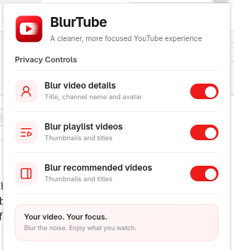
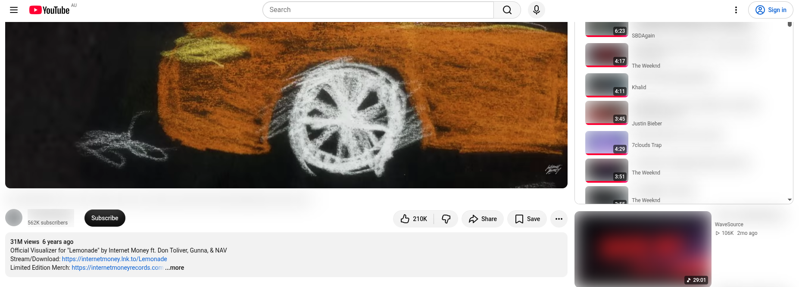

# BlurTube

BlurTube is a lightweight Chrome extension that improves privacy and reduces distractions while watching YouTube.

The video you are watching stays visible, while selected surrounding content can be blurred.

## Preview

### Extension Popup



### YouTube with BlurTube



## Features

BlurTube provides three independent privacy controls:

### Video Details

- Blur the current video title
- Blur the channel name
- Blur the channel avatar

### Playlist Videos

- Blur playlist thumbnails
- Blur playlist titles

### Recommended Videos

- Blur recommended thumbnails
- Blur recommended titles

Each option can be enabled or disabled independently of the BlurTube popup.

## Tech Stack

- React
- TypeScript
- Vite
- Chrome Extension Manifest V3
- `@crxjs/vite-plugin`
- `lucide-react`

## Installation

Clone the repository:

```bash
git clone git@github.com:PradipKafleDev/blur-tube.git
cd blur-tube
```

Install dependencies:

```bash
npm install
```

Build the extension:

```bash
npm run build
```

Then load it in Chrome:

1. Open `chrome://extensions`.
2. Enable **Developer mode**.
3. Click **Load unpacked**.
4. Select the generated `dist` folder.

## Development

After making changes:

```bash
npm run build
```

Then reload BlurTube from `chrome://extensions` and refresh YouTube.

### Useful Commands

```bash
npm run build
npm run lint
npm run lint:fix
npm run format
npm run format:check
```

## Privacy

BlurTube runs locally in your browser.

It does not:

- collect personal information
- collect browsing history
- track users
- send YouTube activity to external servers
- require an account

Your preferences are stored locally using Chrome storage.

## Limitations

YouTube frequently changes its page structure, so BlurTube selectors may occasionally need to be updated.

## License

This project is licensed under the MIT License.

See the `LICENSE` file for details.
